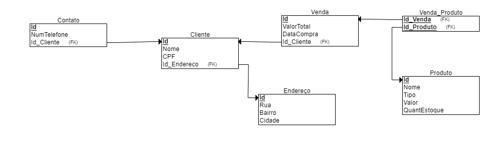
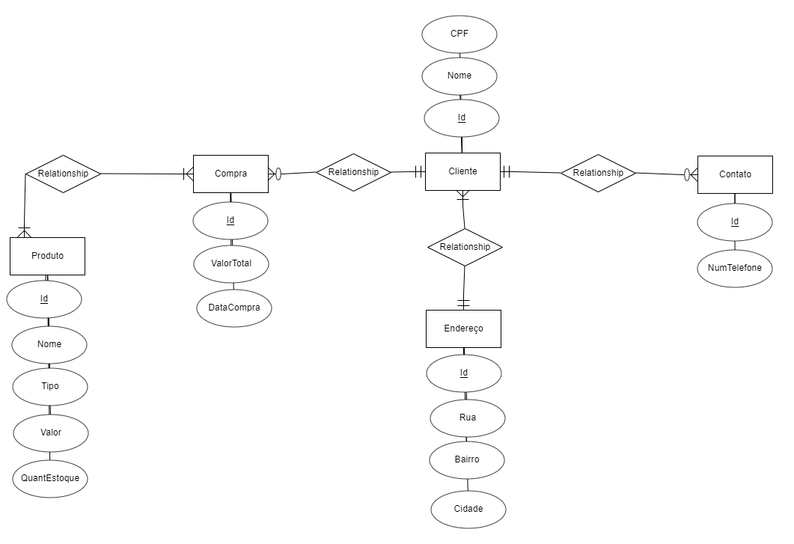

# Exercício de Sistema de Gerenciamento de Floricultura

## Visão Geral
Este projeto consiste em um exercício prático de banco de dados com o intuito de aprimorar os conhecimentos em modelagem e manipulação de dados em um contexto realista. O exercício simula um sistema de gestão para uma floricultura, permitindo o gerenciamento detalhado de clientes, produtos e compras.

## Funcionalidades

**Gestão de Clientes:** Capacidade de registrar e manter informações dos clientes, como RG, nome, telefone e endereço.

**Gestão de Produtos:** Sistema para cadastro de produtos com detalhes como nome, tipo (ex.: flor, vaso, planta), preço e quantidade em estoque.

**Registro de Compras:** Funcionalidade para gravar as compras, detalhando o cliente que realizou a compra, a data, o valor total e os produtos comprados.

## Diagramas
O exercício utiliza dois diagramas fundamentais para representar a estrutura de dados proposta:

**Diagrama Entidade-Relacionamento:** Apresenta as entidades-chave - Produto, Compra, Cliente, Telefone e Endereço - e suas relações.

**Diagrama com Atributos:** Descreve cada entidade com seus atributos específicos:

- Produto: Id, Nome, Tipo, Valor, QuantEstoque
- Compra: Id, ValorTotal, DataCompra
- Cliente: Id, Nome
- Endereço: Id, Rua, Bairro, Cidade
- Contato: Id, NumCelular, NumTelefone
  
## Relacionamentos
**Produto X Compra:** Muitos para muitos, onde diversos produtos podem fazer parte de múltiplas compras.

**Cliente X Compra:** Um para muitos, onde um cliente pode ter várias compras ou nenhuma.

**Cliente X Endereço:** Um para muitos, com cada cliente associado a um ou mais endereços.

**Cliente X Contato:** Um para muitos, onde um cliente pode ter vários meios de contato ou nenhum.

## Implementação no Banco de Dados PostgreSQL
As tabelas foram criadas no PostgreSQL, refletindo a estrutura proposta pelos diagramas. Chaves estrangeiras são utilizadas para manter a integridade dos dados, enquanto índices são empregados para otimizar as consultas.

## Considerações Finais
Este exercício é uma oportunidade valiosa para reforçar o conhecimento teórico em práticas de banco de dados, usando uma aplicação prática que simula situações do mundo real. Ao implementar esse sistema em um ambiente controlado, espera-se não só melhorar a compreensão dos conceitos de banco de dados, mas também desenvolver habilidades que serão úteis em situações profissionais futuras.